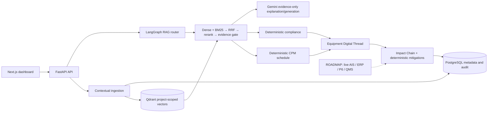

# Project Atlas

**Evidence-backed EPC project intelligence that connects a requirement to its equipment, delivery, schedule, commissioning evidence, and human decision.**

Built for **ET AI Hackathon 2026 — Problem Statement 4: real-time commissioning support across the full project lifecycle**.

| Resource | Status |
| --- | --- |
| Live demo | **Not deployed / not verified** |
| Demo video | **Not recorded / not verified** |
| Architecture | [Architecture overview](docs/ARCHITECTURE.md) · [Mermaid source](docs/ARCHITECTURE.mermaid) |
| Demo walkthrough | [3-minute script](docs/DEMO_SCRIPT.md) |

## Problem and motivation

EPC teams must reconcile specifications, vendor submittals, RFIs, delivery updates, schedules, and commissioning records that live in separate documents and tools. A missed deviation can become a delivery risk, consume schedule float, and surface only at commissioning. Atlas makes that chain inspectable with project-scoped evidence rather than an uncited chatbot response.

## Our solution

Atlas is a Next.js dashboard backed by one FastAPI service. It ingests project documents, retrieves evidence by project, applies deterministic engineering rules for compliance and schedule analysis, and keeps human approvals separate from AI suggestions. Gemini is used only for structured extraction, evidence-grounded explanations, and answer generation; deterministic calculations remain in Python.

### Main innovation: Equipment Digital Thread + Impact Chain

The **Equipment Digital Thread** brings the current specification, vendor submittal, compliance findings, shipment, schedule tasks, commissioning status, NCRs, mitigations, and evidence links together for one equipment item. The **evidence-backed Impact Chain** propagates verified events through:

`specification deviation → vendor resubmission → delivery risk → schedule impact → commissioning impact → human decision`

The seeded SWGR-A scenario demonstrates a deliberate 50 kAIC rating deviation, its cited finding, a vendor-resubmission delivery effect, schedule-float exposure, a readiness decrease, and deterministic mitigation options. It is a synthetic demo scenario, not a production forecast.

## Module status

| Area | Status | Evidence |
| --- | --- | --- |
| Document ingestion, project-scoped storage, PDF/CSV parsing, contextual chunks, Qdrant indexing | **Implemented** | API and ingestion tests |
| Compliance comparison, unit normalization, reviewer actions, audit records | **Implemented** | Synthetic evaluation: TP/FP/FN/TN `6/0/0/6` |
| CPM schedule impact engine | **Implemented** | One planted scenario: predicted/simulated delay `35` days |
| Commissioning procedures, deterministic pass/fail, NCRs, readiness | **Implemented** | `21/21` steps evaluated; expected/actual NCR `1/1` |
| Equipment Digital Thread and project isolation | **Implemented** | API and cross-project tests |
| Advanced RAG, RFI matching, and Gemini-backed cited answers | **Demo implementation** | Evaluated only on synthetic corpus; live Gemini response quality is not verified |
| Supply-chain shipment risk and alternatives | **Demo implementation** | Synthetic shipments/events only; no live tracking |
| Impact Chain and mitigation simulator | **Demo implementation** | Idempotent SWGR-A integration scenario |
| Authentication/RBAC, object storage, queued ingestion, live AIS/weather/ERP/P6/QMS integrations | **Roadmap** | Not represented as active functionality |

## Advanced RAG flow

For a knowledge or RFI request, Atlas uses:

`query rewrite → intent + metadata filters → project-filtered dense + BM25 retrieval → reciprocal-rank fusion → reranking → parent expansion/compression → evidence sufficiency gate → evidence-only generation → claim/citation verification or refusal`

Every selected evidence item retains document, page, section, chunk, and supporting-span information. The workflow can return `INSUFFICIENT_EVIDENCE` instead of completing missing project information from model knowledge. Retrieval, fusion, and deterministic verification do not use an LLM.



## Technology stack

- **Frontend:** Next.js, React, TypeScript, Tailwind CSS.
- **Backend:** FastAPI, SQLAlchemy, Alembic, LangGraph.
- **Data:** PostgreSQL (Supabase-compatible deployment), Qdrant, NetworkX prototype graph.
- **Document processing:** PyMuPDF, optional Tesseract OCR, CSV parser.
- **AI:** Google Gemini through a backend-only gateway; sentence-transformers/local deterministic retrieval components.

## Evaluation results

Values below are calculated from the synthetic evaluation suite in [`evaluation/latest.md`](evaluation/latest.md); they are not customer, production, or historical-performance claims.

| Evaluation area | Calculated evidence |
| --- | --- |
| Compliance | Precision/recall/F1 `1.0/1.0/1.0` on 12 labelled synthetic outcomes |
| Advanced RAG | Recall@5 `0.75`, Recall@12 `1.0`, MRR `1.0`, unsupported-claim rate `0.0`; current correct-document/page/citation-precision metrics are `0.0` |
| Baseline RAG | Recall@5 `0.75`, Recall@12 `0.75`, citation precision `0.8333` |
| Schedule | `35`-day predicted and simulated delay; `0`-day error on one planted case |
| Supply chain | `5/5` synthetic shipments represented; `15` supplier tiers; mean alert latency `55` minutes |
| Commissioning | `21/21` automatically evaluated steps; automation coverage `1.0` |
| Manual effort / savings | **Not measured yet** |

The current advanced pipeline does not outperform the baseline on all guarded quality metrics. This result is retained rather than hidden.

## Hackathon evaluation evidence

| Evaluation area | Atlas evidence |
| --- | --- |
| Specification & quality compliance | Cited requirement/submittal comparison, deterministic unit normalization, reviewer actions, synthetic labelled metrics |
| Schedule risk | CPM dependencies, float, delay propagation, scenario-based risk output with evidence |
| Supply-chain visibility | Synthetic CSV shipments, ETA variance, schedule exposure, alerts, and alternatives; no live positions claimed |
| Commissioning QA | Stored templates, prerequisites, deterministic acceptance evaluation, NCR creation, readiness rules |
| Knowledge & RFIs | Project-filtered hybrid retrieval, citations, duplicate RFI ranking, evidence refusal |
| Lifecycle integration | SWGR-A Impact Chain links deviation through mitigation and a persisted human action |

## Scalability approach

**Roadmap:** move ingestion to idempotent queue workers; store originals in Supabase Storage/object storage; use managed embedding batches and Qdrant tenant/project sharding; add RBAC, quotas, encryption, observability, backups, and disaster recovery; split services only after measured bottlenecks. Live procurement/weather data would enter through validated adapters with source evidence and fallback states.

## Security and project isolation

All persisted/retrieved project data and vector payloads are scoped by `project_id`; API services include project-isolation tests. Upload validation and size limits are configured centrally. Backend secrets remain server-only: never expose `GEMINI_API_KEY`, `QDRANT_API_KEY`, `DATABASE_URL`, `SUPABASE_SERVICE_ROLE_KEY`, or `JWT_SECRET_KEY` to the browser. **Authentication and RBAC are roadmap items**, so this demo must remain behind an authenticated gateway before public exposure.

## Local demo

Prerequisites: Python 3.11+, Node.js/npm, Docker Compose, and a Gemini API key. Tesseract is needed only for OCR fallback on image-only PDFs.

```bash
cp .env.example .env
# Add GEMINI_API_KEY to .env (never commit it)
./scripts/start_demo.sh
```

This creates/reuses the synthetic `Atlas Synthetic Demo` project, uploads 27 synthetic documents, seeds five synthetic shipments, and restores the idempotent SWGR-A vertical scenario. Open [http://localhost:3000](http://localhost:3000); FastAPI documentation is at [http://localhost:8001/docs](http://localhost:8001/docs).

There are no demo credentials because application authentication is not implemented. Use the local demo only or put a deployed instance behind an authenticated gateway.

### Environment-variable names

**Backend:** `DATABASE_URL`, `SUPABASE_URL`, `SUPABASE_SERVICE_ROLE_KEY`, `QDRANT_URL`, `QDRANT_API_KEY`, `GEMINI_API_KEY`, `GEMINI_MODEL`, `JWT_SECRET_KEY`, `FRONTEND_URL`.

**Frontend:** `NEXT_PUBLIC_API_URL`, `NEXT_PUBLIC_SUPABASE_URL`, `NEXT_PUBLIC_SUPABASE_ANON_KEY`.

See [`.env.example`](.env.example) for names only and [DEPLOY.md](DEPLOY.md) for the environment matrix, migration command, idempotent seed/reset commands, and Render/Vercel setup.

## Testing

```bash
python3 -m pytest -q
python3 -m compileall -q app scripts evaluation migrations
python3 -m evaluation.run_all
(cd frontend && npm run lint && npm run typecheck && npm test && npm run build)
```

Old documents are reindexed only when explicitly requested:

```bash
python3 -m scripts.reindex --project-id <PROJECT_UUID>
```

## Deployment

The prepared target is **Vercel** for `frontend` and **Render** for FastAPI using [`render.yaml`](render.yaml); Supabase-compatible PostgreSQL and Qdrant Cloud are configured through backend-only variables. The production start script runs `alembic upgrade head` then Uvicorn on Render’s `$PORT`.

No public deployment has been verified. Follow [DEPLOY.md](DEPLOY.md) after configuring authenticated cloud accounts and environment variables.

## Repository structure

```text
app/                    FastAPI services, models, workflow, deterministic engines
frontend/               Next.js dashboard and typed API client
data/synthetic_epc/     Clearly marked synthetic EPC corpus and ground truth
migrations/             Alembic schema migrations
tests/                  Backend unit, API, and integration tests
evaluation/             Reproducible synthetic evaluation inputs and reports
scripts/                Demo seed, reindex, evaluation, and startup commands
docs/                   Architecture, demo, provenance, limitations, licenses
```

## Known limitations and roadmap

See [LIMITATIONS.md](docs/LIMITATIONS.md) and [ROADMAP.md](docs/ROADMAP.md). The key limitations are synthetic-only operational data, no application auth/RBAC, no live logistics/weather/enterprise integration, local/prototype graph storage, and unverified live Gemini quality. The next production step is authenticated tenancy and queued, object-storage-backed ingestion—not additional UI features.

## Team

- Team member 1 — _name and role to be added_
- Team member 2 — _name and role to be added_
- Team member 3 — _name and role to be added_

## Third-party acknowledgements and data notice

Dependency and license notes are in [LICENSES.md](docs/LICENSES.md). All materials under [`data/synthetic_epc/`](data/synthetic_epc/) are fictional and clearly marked synthetic. They do not represent official TIA-942, BICSI, Uptime Institute, manufacturer, client, or project requirements.
