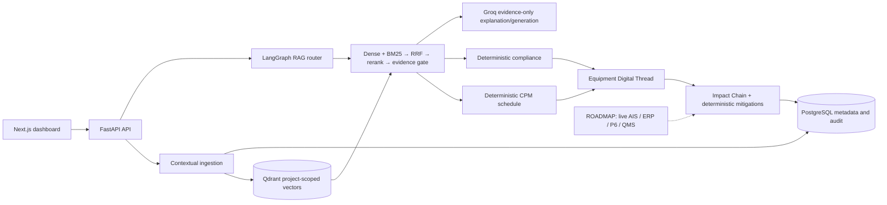

# Project Atlas

**Evidence-backed EPC project intelligence that connects a requirement to its equipment, delivery, schedule, commissioning evidence, and human decision.**

Built for **ET AI Hackathon 2026 — Problem Statement 4: real-time commissioning support across the full project lifecycle**.

| Resource | Status |
| --- | --- |
| Live demo | **https://atlas-theproject.duckdns.org** |
| Demo video | **Not recorded / not verified** |
| Architecture | [Architecture overview](docs/ARCHITECTURE.md) · [Mermaid source](docs/ARCHITECTURE.mermaid) |
| Demo walkthrough | [3-minute script](docs/DEMO_SCRIPT.md) |

## Problem and motivation

EPC teams must reconcile specifications, vendor submittals, RFIs, delivery updates, schedules, and commissioning records that live in separate documents and tools. A missed deviation can become a delivery risk, consume schedule float, and surface only at commissioning. Atlas makes that chain inspectable with project-scoped evidence rather than an uncited chatbot response.

## Our solution

Atlas is a Next.js dashboard backed by one FastAPI service. It ingests project documents, retrieves evidence by project, applies deterministic engineering rules for compliance and schedule analysis, and keeps human approvals separate from AI suggestions. Groq is used only for structured extraction, evidence-grounded explanations, and answer generation; deterministic calculations remain in Python.

### Main innovation: Equipment Digital Thread + Impact Chain

The **Equipment Digital Thread** brings the current specification, vendor submittal, compliance findings, shipment, schedule tasks, commissioning status, NCRs, mitigations, and evidence links together for one equipment item. The **evidence-backed Impact Chain** propagates verified events through:

`specification deviation → vendor resubmission → delivery risk → schedule impact → commissioning impact → human decision`

The seeded SWGR-A scenario demonstrates a deliberate 50 kAIC rating deviation, its cited finding, a vendor-resubmission delivery effect, schedule-float exposure, a readiness decrease, and deterministic mitigation options. It is a synthetic demo scenario, not a production forecast.

## Module status

| Area | Status | Evidence |
| --- | --- | --- |
| Document ingestion, project-scoped storage, PDF/CSV parsing, contextual chunks, Qdrant indexing | **Implemented** | API and ingestion tests |
| Compliance comparison, unit normalization, reviewer actions, audit records | **Implemented** | Synthetic evaluation: TP/FP/FN/TN `6/0/0/6` |
| CPM schedule impact engine | **Implemented** | 12 labelled cases over 6 tasks and 2 analysis dates: mean absolute prediction error `1.5` days, max `3`; lead time `0`–`65` days |
| Weather and workforce as evidenced schedule inputs | **Implemented** | Derived from a dated site conditions log, not caller-supplied; every delay day cites the rows behind it |
| Commissioning procedures, deterministic pass/fail, NCRs, readiness | **Implemented** | `21/21` steps evaluated; expected/actual NCR `1/1` |
| Equipment Digital Thread and project isolation | **Implemented** | API and cross-project tests |
| Advanced RAG, RFI matching, and Groq-backed cited answers | **Demo implementation** | Evaluated only on synthetic corpus; live Groq response quality is not verified |
| Supply-chain shipment risk and alternatives | **Demo implementation** | Synthetic shipments/events only; no live tracking. 8 alerts across 5 shipments, latency `20`–`420` min (median `75`) |
| Impact Chain and mitigation simulator | **Demo implementation** | Idempotent SWGR-A integration scenario |
| Authentication and per-project RBAC | **Implemented** | scrypt password hashing, HMAC-signed session tokens, viewer/reviewer/admin per project; non-members get 404, not 403 |
| Object storage, queued ingestion, live AIS/weather/ERP/P6/QMS integrations | **Roadmap** | Not represented as active functionality |

## Advanced RAG flow

For a knowledge or RFI request, Atlas uses:

`query rewrite → intent + metadata filters → project-filtered dense + BM25 retrieval → reciprocal-rank fusion → reranking → parent expansion/compression → evidence sufficiency gate → evidence-only generation → claim/citation verification or refusal`

Every selected evidence item retains document, page, section, chunk, and supporting-span information. The workflow can return `INSUFFICIENT_EVIDENCE` instead of completing missing project information from model knowledge. Retrieval, fusion, and deterministic verification do not use an LLM.


```mermaid
flowchart LR
  UI["Next.js dashboard"] --> API["FastAPI API"]
  API --> RAG["LangGraph RAG router"]
  API --> ING["Contextual ingestion"]
  ING --> DB[("PostgreSQL metadata and audit")]
  ING --> Q[("Qdrant project-scoped vectors")]
  RAG --> RET["Dense + BM25 → RRF → rerank → evidence gate"]
  Q --> RET
  RET --> GEM["Groq evidence-only explanation/generation"]
  RET --> COMP["Deterministic compliance"]
  RET --> SCH["Deterministic CPM schedule"]
  COMP --> THREAD["Equipment Digital Thread"]
  SCH --> THREAD
  THREAD --> IMPACT["Impact Chain + deterministic mitigations"]
  IMPACT --> DB
  AIS["ROADMAP: live AIS / ERP / P6 / QMS"] -.-> IMPACT
```

## Technology stack

- **Frontend:** Next.js, React, TypeScript, Tailwind CSS.
- **Backend:** FastAPI, SQLAlchemy, Alembic, LangGraph.
- **Data:** PostgreSQL (Supabase-compatible deployment), Qdrant, NetworkX prototype graph.
- **Document processing:** PyMuPDF, optional Tesseract OCR, CSV parser.
- **AI:** a backend-only gateway that routes generation across OpenAI-compatible providers in a configured order (`ATLAS_LLM_PROVIDERS`), failing over on rate limits and outages - Groq, OpenRouter, Gemini, NVIDIA, SiliconFlow, ModelScope, Mistral, Hugging Face, Ollama and LLM7 are registered; sentence-transformers `all-MiniLM-L6-v2` for semantic embeddings and `ms-marco-MiniLM-L-6-v2` for reranking. A deterministic non-semantic hash embedder (`ATLAS_EMBEDDING_BACKEND=local_hash`) is retained for offline runs and the evaluation harness.

## Evaluation results

Values below are calculated from the synthetic evaluation suite in [`evaluation/latest.md`](evaluation/latest.md); they are not customer, production, or historical-performance claims.

| Evaluation area | Calculated evidence |
| --- | --- |
| Compliance | Precision/recall/F1 `1.0/1.0/1.0` on 12 labelled synthetic outcomes |
| Advanced RAG | On **16 held-out questions**: Recall@5 `0.9231`, Recall@12 `1.0`, MRR `0.7521`, correct-document rate `0.8462`, correct-page rate `0.6923`, citation precision `0.2432`, unsupported-claim rate `0.0`, `172.94` mean input tokens |
| Baseline RAG | Same 16 questions: Recall@5 `0.9231`, Recall@12 `0.9231`, MRR `0.6269`, correct-document rate `0.6923`, citation precision `0.3226`, `457.88` mean input tokens |
| Schedule | **12 cases** over 6 tasks and 2 analysis dates: mean absolute prediction error `1.5` days (`0`–`3`, median `3`); lead time `0`–`65` days, median `28` |
| Supply chain | `5/5` synthetic shipments, `15` supplier tiers, all 5 carrying events. **8 alerts**: latency `20`–`420` minutes, median `75`, `6/8` inside two hours; first alert `17`–`55` days before planned arrival |
| Commissioning | `21/21` automatically evaluated steps; automation coverage `1.0` |
| Manual effort / savings | **Not measured yet** |

**Read the held-out set size first.** These numbers were previously reported on **three** test questions, where one extra citation on one question moved citation precision by a third — which is exactly what produced the old `0.6667`. The labelled set is now **12 development and 16 test** questions, every case written against text read out of the corpus with its document, page and clause checked.

**Two defects in the harness were found and fixed while expanding it.**

1. *The comparison was not reproducible.* The parameter search ranked trials on four quality metrics and broke ties on **measured wall-clock latency** — and the quality terms tie on most trials, so the tiebreaker decided. Consecutive runs of the same script selected different parameters and reported different numbers. The tiebreaker is now mean input tokens, which is a property of the pipeline rather than of the machine; three consecutive runs now agree exactly, and a test asserts it.
2. *Citation precision rewarded redundancy.* It counted every citation separately, so citing one correct page three times scored `3/3` while citing the correct page plus two others scored `1/3`. Dense retrieval routinely returns near-duplicate chunks from one page, so the metric partly measured how repetitive the top three was. It is now the standard set-based definition over distinct cited references; the per-citation figure is still reported beside it.

**What the corrected comparison shows.** Advanced retrieval wins on ranking and cost — MRR `0.7521` against `0.6269`, correct-document rate `0.8462` against `0.6923`, Recall@12 `1.0` against `0.9231`, and **2.6× fewer input tokens** (`172.94` against `457.88`). It ties on Recall@5, correct-page rate, refusal accuracy and unsupported-claim rate. It **loses** on citation precision (`0.2432` against `0.3226`) and completeness, and the cause is visible in the per-case data: on questions like *"what operating aisle is required"* the correct page is retrieved but ranked sixth, and the responder cites its top three. Better ranking overall, worse final citation selection. The guard therefore still declines to claim an improvement, and the result is reported rather than hidden.

## Hackathon evaluation evidence

| Evaluation area | Atlas evidence |
| --- | --- |
| Specification & quality compliance | Cited requirement/submittal comparison, deterministic unit normalization, reviewer actions, synthetic labelled metrics |
| Schedule risk | CPM dependencies, float, delay propagation, scenario-based risk output with evidence |
| Supply-chain visibility | Synthetic CSV shipments, ETA variance, schedule exposure, alerts, and alternatives; no live positions claimed |
| Commissioning QA | Stored templates, prerequisites, deterministic acceptance evaluation, NCR creation, readiness rules |
| Knowledge & RFIs | Project-filtered hybrid retrieval, citations, duplicate RFI ranking, evidence refusal |
| Lifecycle integration | SWGR-A Impact Chain links deviation through mitigation and a persisted human action |

## Scalability approach

**Roadmap:** move ingestion to idempotent queue workers; store originals in Supabase Storage/object storage; use managed embedding batches and Qdrant tenant/project sharding; add RBAC, quotas, encryption, observability, backups, and disaster recovery; split services only after measured bottlenecks. Live procurement/weather data would enter through validated adapters with source evidence and fallback states.

## Security and project isolation

All persisted/retrieved project data and vector payloads are scoped by `project_id`; API services include project-isolation tests. Upload validation and size limits are configured centrally. Backend secrets remain server-only: never expose `GROQ_API_KEY`, `QDRANT_API_KEY`, `DATABASE_URL`, `SUPABASE_SERVICE_ROLE_KEY`, or `JWT_SECRET_KEY` to the browser.

**Authentication is implemented and enabled on the deployment** (`ATLAS_AUTH_ENABLED=true`). Passwords are hashed with `hashlib.scrypt` and session tokens are HMAC-SHA256 signed — both from the standard library, deliberately, rather than adding a dependency. A user is global; `project_members` grants **viewer**, **reviewer** or **admin** per project. Reading needs viewer, mutating needs reviewer, managing members needs admin. A non-member receives **404, not 403**, because a 403 would confirm the project exists.

Its limits are specific and worth stating: tokens are short-lived but **cannot be revoked** (deactivating a user takes effect immediately, since the account is re-read on every request, but an issued token otherwise stands until it expires); there is **no password-reset flow**; and `/auth/login` is **not rate-limited** — repeated attempts are logged, not throttled.

## Local demo

Prerequisites: Python 3.11+, Node.js/npm, Docker Compose, and a Groq API key. Tesseract is needed only for OCR fallback on image-only PDFs.

```bash
cp .env.example .env
# Add GROQ_API_KEY to .env (never commit it)
./scripts/start_demo.sh
```

This creates/reuses the synthetic `Atlas Synthetic Demo` project, uploads 28 synthetic documents (including the site conditions log the schedule analysis reads weather and workforce from), seeds five synthetic shipments, and restores the idempotent SWGR-A vertical scenario. Open [http://localhost:3000](http://localhost:3000); FastAPI documentation is at [http://localhost:8001/docs](http://localhost:8001/docs).

Create a local account with `python scripts/create_user.py` (minimum password length is 12). On the deployment, a read-only account is provided for reviewers — see **Deployment** below.

### Environment-variable names

**Backend:** `DATABASE_URL`, `SUPABASE_URL`, `SUPABASE_SERVICE_ROLE_KEY`, `QDRANT_URL`, `QDRANT_API_KEY`, `GROQ_API_KEY`, `GROQ_MODEL`, `JWT_SECRET_KEY`, `FRONTEND_URL`.

**Frontend:** `NEXT_PUBLIC_API_URL`, `NEXT_PUBLIC_SUPABASE_URL`, `NEXT_PUBLIC_SUPABASE_ANON_KEY`.

See [`.env.example`](.env.example) for names only, [DEPLOY.md](DEPLOY.md) for the environment matrix, migration command, and idempotent seed/reset commands, and [`deploy/env.aws.example`](deploy/env.aws.example) for the single-instance AWS deployment.

## Testing

```bash
python3 -m pytest -q                    # 222 backend tests
python3 -m compileall -q app scripts evaluation migrations
ATLAS_LLM_PROVIDERS= python3 -m evaluation.run_all
(cd frontend && npm run lint && npm run typecheck && npm test && npm run build)   # 22 frontend tests
```

`ATLAS_LLM_PROVIDERS=` disables the narrator for the evaluation run. Narration is
not an input to any metric, and leaving providers enabled makes the run take
minutes longer while it retries rate-limited endpoints.

The evaluation is reproducible: two runs of the same script produce identical
numbers, and `tests/test_evaluate_synthetic.py` asserts it. That was not true
before — the parameter search broke ties on measured wall-clock latency, so the
host decided which hyperparameters won.

Old documents are reindexed only when explicitly requested:

```bash
python3 -m scripts.reindex --project-id <PROJECT_UUID>
```

### Migrating an index created before semantic embeddings

Retrieval now uses a sentence-transformer model (384 dimensions) instead of the
previous non-semantic hash embedder (1536 dimensions), so `ATLAS_INDEX_VERSION`
moved to `3`. Vectors written by an earlier version are not comparable and a
Qdrant collection created at the old width cannot accept the new ones —
ingestion fails with `embedding_dimension_mismatch` (409) rather than storing
mixed vectors. To migrate an existing deployment, drop the collection and
rebuild it:

```bash
curl -X DELETE "$QDRANT_URL/collections/atlas_chunks"   # or set ATLAS_QDRANT_COLLECTION to a new name
python3 -m scripts.reindex --project-id <PROJECT_UUID> --force
```

To run fully offline, or to reproduce the deterministic evaluation numbers, set
`ATLAS_EMBEDDING_BACKEND=local_hash`. That backend is not semantic and will not
match paraphrased questions.

## Deployment

Two prepared targets, described in [DEPLOY.md](DEPLOY.md):

- **AWS, single instance** — one EC2 box runs the API, dashboard, PostgreSQL, Qdrant and Caddy through [`docker-compose.aws.yml`](docker-compose.aws.yml); GitHub Actions builds both images and the instance pulls them, so a push to `main` rolls out. Self-contained, free-tier sized, and uploads are durable on named volumes. See [docs/AWS_DEPLOY.md](docs/AWS_DEPLOY.md).
- **Render + Vercel** — `frontend` on Vercel and FastAPI on Render using [`render.yaml`](render.yaml), with Supabase-compatible PostgreSQL and Qdrant Cloud configured through backend-only variables. The production start script runs `alembic upgrade head` then Uvicorn on Render’s `$PORT`.

The live demo runs on the AWS target: a single `t3.micro` in `ap-south-1` behind Caddy with a Let's Encrypt certificate, serving the seeded synthetic project (28 documents, 5 shipments, the SWGR-A scenario). `/ready` reports `api`, `database` and `qdrant` healthy.

**Access.** Authentication is enabled on the deployment. A read-only account is available for reviewers — `viewer@atlas.demo` — and it cannot upload, approve, or reset anything. The data is synthetic and labelled throughout.

**One caveat stated plainly.** The evidence-backed copilot answers most questions and refuses a specific class of them. Measured on the deployment: *"Is the ArcLine switchgear submittal compliant with the interrupting rating requirement?"* returns three supported, cited claims, and *"What battery autonomy is required for the UPS?"* answers on 3 of 3 attempts — but *"What interrupting rating does the switchgear specification require?"* refuses on 3 of 3, at 131–141 context tokens against 428 for the phrasing that works. The outcome is stable per phrasing, so it is structural rather than random, and it is **not yet root-caused**. Every rejected claim now logs its citations, the terms absent from the evidence, and the term overlap, so it can be diagnosed rather than guessed at. Demo the compliance-framed question — it is the stronger demonstration anyway, because it shows a comparison rather than a lookup. The deterministic engines — compliance, schedule, commissioning, digital thread, impact chain — are unaffected.

## Repository structure

```text
app/                    FastAPI services, models, workflow, deterministic engines
frontend/               Next.js dashboard and typed API client
data/synthetic_epc/     Clearly marked synthetic EPC corpus, site conditions log, and ground truth
migrations/             Alembic schema migrations
tests/                  Backend unit, API, and integration tests
evaluation/             Reproducible synthetic evaluation inputs and reports
scripts/                Demo seed, reindex, evaluation, and startup commands
deploy/                 EC2 bootstrap, Caddy reverse proxy, AWS env template
docs/                   Architecture, demo, provenance, limitations, licenses
```

## Known limitations and roadmap

See [LIMITATIONS.md](docs/LIMITATIONS.md) and [ROADMAP.md](docs/ROADMAP.md). The key limitations are synthetic-only operational data, no live logistics/weather/enterprise integration, local/prototype graph storage, unverified live Groq quality, and an authentication layer whose tokens cannot be revoked and whose login endpoint is not rate-limited. Hours saved remains `NOT_MEASURED` — the brief asks for it and we will not invent a figure. The next production step is measured pilot data and queued, object-storage-backed ingestion, not additional UI features.

## Team


## Third-party acknowledgements and data notice

Dependency and license notes are in [LICENSES.md](docs/LICENSES.md). All materials under [`data/synthetic_epc/`](data/synthetic_epc/) are fictional and clearly marked synthetic. They do not represent official TIA-942, BICSI, Uptime Institute, manufacturer, client, or project requirements.
